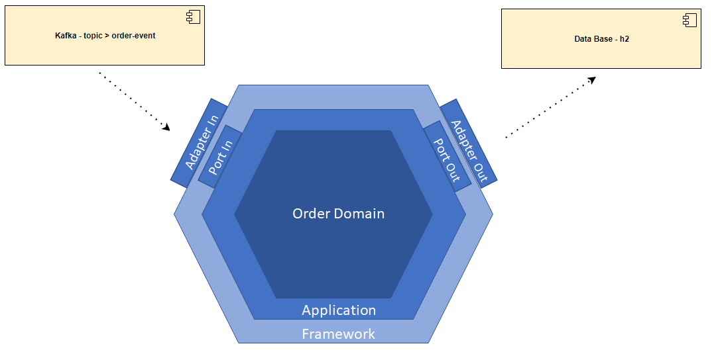

### **HISTÓRICO DE ELABORAÇÃO**
| **Data**     | **Versão**   | **Autor**                      | **Descrição da Alteração** |
|:------------:|:------------:|:------------------------------:|:--------------------------:|
| _23/12/2021_ | _01_         | _eduardo.navas@telefonica.com_  | _Criação do documento_   
---

### **1 Contexto**
Avaliação fast-track spring boot

### **2 Escopo**
MicroServiço responsavél consumir eventos do topico kafka atualizar status do order e atualizar na base de dados .

### **3 Componentes**

### 4 Operações
#### 4.1 Consumo do topico kafka
Consme uma order do topico kafka, verifica se a order consumida existe no banco, se sim atualiza o status do order para PROCESSED e salva a order atualizada no banco de dados.

### **5. Adapters**

#### 5.1.  Banco de dados H2
O banco de dados h2 esta configurado no application.yml. Na configuração spring.datasource.url é especificada a pasta onde o h2 armazenara os dados.

#### 5.2.  Kafka
Todas as configurações do kafka estão no application.yml e na classe br.com.vivo.orderconsumer.framework.adapter.in.kafka.config.KafkaConfig.java